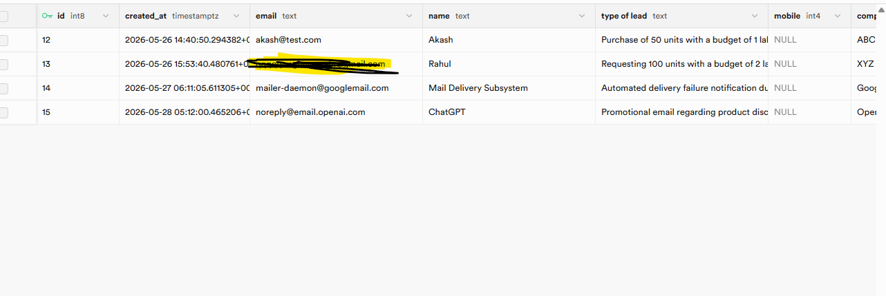
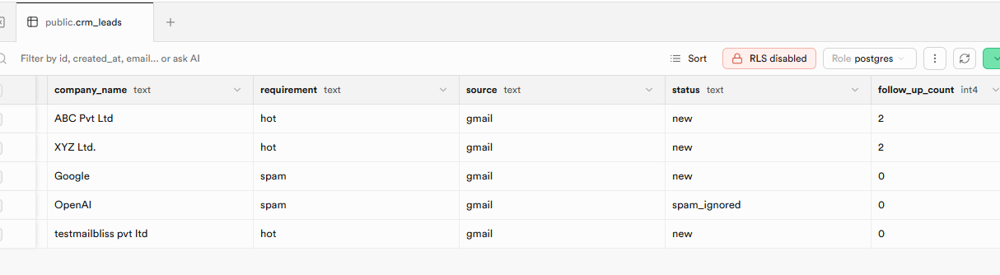

# AI CRM Dashboard

A real industry-level AI CRM system built with n8n, Gemini AI, Supabase and React.

## What it does
- Gmail se automatically lead capture
- AI (Gemini) se lead classification - Hot/Warm/Spam
- Auto-reply to hot leads
- Telegram alerts to sales team
- Autonomous follow-up agent (24hr/3day/7day)
- Auto-archive after no response
- React Dashboard to manage leads

## Tech Stack
- n8n (workflow automation)
- Google Gemini (AI)
- Supabase (database)
- React + Tailwind (frontend)
- Gmail + Telegram

## Features
- Zero manual work
- Fully automated lead pipeline
- Real SaaS CRM architecture

## Screenshots

### AI CRM Dashboard

### n8n Workflow

### Demo Video
[▶ Watch Live Demo](https://youtu.be/sarv8-PlDi4)

### Gmail Integration

### Supabase Database

